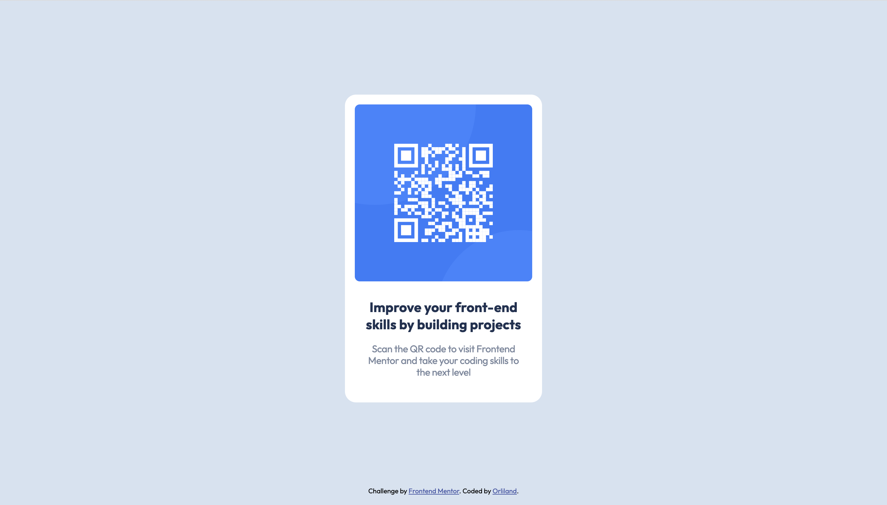

# Frontend Mentor - QR code component solution

This is a solution to the [QR code component challenge on Frontend Mentor](https://www.frontendmentor.io/challenges/qr-code-component-iux_sIO_H). Frontend Mentor challenges help you improve your coding skills by building realistic projects.

## Table of contents

- [Overview](#overview)
  - [Screenshot](#screenshot)
  - [Links](#links)
  - [Built with](#built-with)
- [Author](#author)

## Overview

### Screenshot

**Mobile Version**

**Desktop Version**

### Links

- Solution URL: [Github Repository](https://github.com/Orliland/qr-code-component-main)
- Live Site URL: [GitHub Page](https://Orliland.github.io/qr-code-component-main)

### Built with

- CSS custom properties
- CSS Grid
- Mobile-first workflow

## Author

- Website - [My Portfolio](https://orli.land)
- Frontend Mentor - [@Orliland](https://www.frontendmentor.io/profile/Orliland)
- Twitter - [@Orliland](https://www.twitter.com/Orliland)
